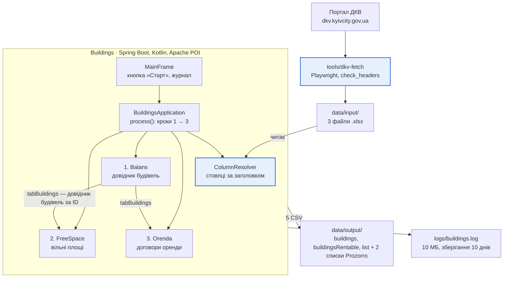

# ТЗ: Buildings і tools/dkv-fetch

2026-10-03 · Volodymir Voloshyn

## 1. Загальні відомості

Система перетворює три Excel-вивантаження муніципального реєстру нерухомості Києва на п'ять нормалізованих CSV-файлів для публікації відкритих даних. ТЗ відновлено за вихідним кодом (реверс-інжиніринг) і описує фактичну поведінку на коміті f1eae21.

Склад системи:

| Компонент | Призначення | Технологія |
| --- | --- | --- |
| Buildings (корінь репозиторію) | Пакетна обробка Excel → CSV з графічною оболонкою | Kotlin, Spring Boot, Apache POI, Swing |
| tools/dkv-fetch | Автоматичне завантаження вихідних звітів з порталу ДКВ у data/input/ | Node.js, Playwright |

Терміни:

| Термін | Значення |
| --- | --- |
| ДКВ | Департамент комунальної власності м. Києва, власник порталу-джерела звітів |
| Баланс | Реєстр об'єктів на балансі комунальних підприємств (файл Баланс.xlsx) |
| Вільні площі | Перелік вільних приміщень, що пропонуються в оренду (ВільніПлощі.xlsx) |
| Оренда | Перелік договорів оренди (Оренда.xlsx) |
| Балансоутримувач | Підприємство, на балансі якого перебуває об'єкт; ідентифікується кодом ЄДРПОУ |
| Prozorro.Sale / ЕТС | Електронна торгова система аукціонів; код об'єкта починається з LL, UA або RG |
| Група призначення 634 | Код групи призначення об'єкта, що виключається з публічного довідника будівель |
| CATUTTC | Код КАТОТТГ територіальної громади; для Києва — UA80000000000093317 |

## 2. Цілі та межі

Мета — отримувати відтворюваний набір відкритих даних про комунальні будівлі, вільні площі та чинні договори оренди одним натисканням кнопки, без ручного редагування таблиць.

У межах системи:

- завантаження звітів з порталу ДКВ (tools/dkv-fetch);
- перевірка структури вхідних файлів за назвами заголовків стовпців;
- фільтрація, збагачення та зіставлення записів між трьома файлами;
- маскування персональних даних фізичних осіб-орендарів;
- запис п'яти CSV-файлів і журналу роботи.

Поза межами:

- REST API, база даних, багатокористувацька робота;
- публікація CSV на порталі відкритих даних (виконується вручну);
- редагування вихідних даних і зворотний запис у Excel;
- планувальник запусків — обробка запускається користувачем вручну.

## 3. Архітектура та технологічний стек

Дані рухаються в одному напрямку: портал → dkv-fetch → data/input/ → Buildings → data/output/. Компоненти пов'язані лише через файли й запускаються незалежно.

Виділено компоненти, що перевіряють наявність обов'язкових стовпців: заголовки звіряються двічі — під час завантаження і перед обробкою.

Кроки 1–3 виконуються суворо по черзі: FreeSpace і Orenda беруть атрибути будівлі з довідника, побудованого Balans.

| Шар | Компоненти | Технології |
| --- | --- | --- |
| Інтерфейс | MainFrame, TextAreaAppender | Swing, Logback-апендер |
| Оркестрація | BuildingsApplication (єдиний Spring-бін) | Spring Boot 4.1, конфігурація через @Value |
| Обробка | Balans, FreeSpace, Orenda, ColumnResolver, Utils (Kotlin object, без стану) | Kotlin 2.4, JDK 26 |
| Схема даних | BalansIndex, FreeSpaceIndex, OrendaIndex (заголовки Excel); BuildingIndex (36 позицій запису будівлі) | enum |
| Введення-виведення | ServiceXlsx, запис CSV | Apache POI 5.2.3, java.nio |
| Збірка та тести | build.gradle.kts | Gradle 9, JUnit 5 |
| Завантаження джерел | fetch-reports.mjs, check_headers.py | Node.js (ESM), Playwright + Chromium, Python 3 |

Результати кроків передаються незмінними data-класами (FreeSpaceData, OrendaData); спільного змінного стану немає.

## 4. Функціональні вимоги до Buildings

Обробка йде в три послідовні кроки; Баланс будує довідник будівель, а Вільні площі та Оренда беруть з нього атрибути будівлі за її ID. Помилка на будь-якому кроці перериває решту.

### 4.1. Вхідні файли

| Файл | Рядки заголовка (0-based) | Перший рядок даних | Обов'язкових стовпців |
| --- | --- | --- | --- |
| data/input/Баланс.xlsx | 1 | 2 | 19 |
| data/input/ВільніПлощі.xlsx | 1–2 (дворівневий) | 3 | 9 |
| data/input/Оренда.xlsx | 1 | 2 | 19 |

Читається лише перший аркуш книги. Шляхи задаються в application.yml (див. розділ 8).

### 4.2. Зіставлення стовпців

- Стовпець знаходиться за текстом заголовка, а не за позицією. Порядок стовпців і зайві стовпці не впливають на результат.
- Порівняння суворе: текст після trim() має збігатися з еталоном у enum (BalansIndex, FreeSpaceIndex, OrendaIndex) до символу.
- У дворівневому заголовку ВільніПлощі для кожного стовпця перемагає нижній рядок (підзаголовок).
- Якщо заголовок повторюється, береться стовпець із меншим номером.
- Якщо хоча б один обов'язковий стовпець не знайдено, обробка зупиняється з помилкою, у якій перелічено відсутні та всі знайдені заголовки.
- Два заголовки містять апостроф U+2019 (’): «ID об’єктів за договором» (Оренда) і «Загальна площа об’єкта» (ВільніПлощі); решта — U+0027.

### 4.3. Крок 1 — Баланс

Результат — довідник будівель у пам'яті (36 полів BuildingIndex, ключ — ID об'єкта). Рядок відкидається, якщо:

1. код ЄДРПОУ балансоутримувача дорівнює 22991617;
2. сфера діяльності дорівнює «Невизначені»;
3. ID об'єкта нечисловий або порожній.

Правила формування полів:

- Власник завжди «Київська міська рада», код 22883141; одиниця площі «кв. м.»; країна «Україна».
- Район вважається київським, якщо містить одну з 10 назв районів Києва; «Києво-Святошинський» — не київський.
- Для київського району: CATUTTC = UA80000000000093317, L2 = «м. Київ», населений пункт «Київ», район — у addressPostDistrict. Для інших: ці поля null, район — у addressAdminUnitL4.
- Статус реєстрації: «Зареєстровано», якщо реєстраційний номер заповнений, інакше «Невідомо».
- Номер будинку в довіднику замінюється на «XXX».
- Якщо ID повторюється, останній рядок замінює попередній.
- Будівлі з групою призначення, що містить «634», залишаються в довіднику для зіставлення, але не потрапляють у buildings.csv.

### 4.4. Крок 2 — Вільні площі

1. Рядок пропускається, якщо реєстраційний № нечисловий; якщо ID об'єкта нечисловий (WARN); якщо будівлю не знайдено в довіднику (INFO).
2. Якщо клітинка коду ЕТС текстова — рядок йде до списку Prozorro: (реєстр. №, назва будівлі, URL аукціону).
3. Інакше — до списку вільних площ: атрибути будівлі з довідника, площа й номер будинку — з файлу, ідентифікатор «<реєстр. №>-<ID будівлі>», плюс 4 поля комунікацій.
4. Комунікації: вода, тепло, газ — false, якщо порожньо або «ні», інакше true; потужність електромережі — текст як є.

### 4.5. Крок 3 — Оренда

Рядок перевіряється в такому порядку; перша невиконана умова його відкидає:

1. ID договору числовий;
2. дата актуальності заповнена і не раніша за 2020-01-01 (лічильники пропусків — у журналі);
3. стан договору точно «Договір діє»;
4. список ID об'єктів (через «;») непорожній;
5. перший ID із списку знайдено в довіднику;
6. жодна будівля зі списку не має групи призначення 634.

Далі, як і для вільних площ: текстовий код ЕТС — до списку Prozorro (код ЕТС, назва будівлі, URL), інакше — до списку договорів з ідентифікатором «<ID договору>-<ID будівлі>».

Код ЄДРПОУ орендаря довжиною 10 символів (РНОКПП фізособи) замінюється на «XXXXXXXXXX»; 8-значні коди юросіб виводяться як є.

### 4.6. Коди ЕТС і URL

- Якщо в клітинці посилання (http… або опечатка hhttp…), кодом вважається останній сегмент шляху (або передостанній, якщо останній коротший за 2 символи).
- LL… і UA… → https://prozorro.sale/auction/<код>; RG… → https://prozorro.sale/planning/<код>; інші — вихідне значення без змін.

## 5. Вихідні дані

Система записує п'ять CSV-файлів у data/output/, перезаписуючи попередні. Назви стовпців — латиницею (схема наборів відкритих даних про комунальне майно).

| Файл | Джерело | Вміст | Стовпців | Ключ рядка |
| --- | --- | --- | --- | --- |
| buildings.csv | Баланс | Довідник будівель без групи 634 | 35 | id |
| buildingsRentable.csv | Вільні площі | Вільні площі без коду ЕТС | 39 | buildingId = «реєстр.№-ID будівлі» |
| listProzorroSales_buildingsRentable.csv | Вільні площі | Вільні площі, виставлені на аукціон | 3 | ocid = реєстр. № |
| list.csv | Оренда | Чинні договори оренди без коду ЕТС | 38 | id = «ID договору-ID будівлі» |
| listProzorroSales_rented.csv | Оренда | Чинні договори, укладені через аукціон | 3 | ocid = код ЕТС |

### 5.1. Формат файлу

- Кодування UTF-8 без BOM, роздільник «,», кінець рядка LF, перший рядок — заголовок без лапок.
- Текстове значення береться в подвійні лапки, внутрішня лапка подвоюється (RFC 4180).
- Порожнє значення виводиться літералом null без лапок.
- Дати — ISO 8601 (yyyy-MM-dd); якщо в клітинці текст, він переноситься як є.
- Грошові суми (valueAmount, contractValueAmount) — два знаки після крапки, для нечислової клітинки — 0.00; валюта завжди UAH, період — «Місяць».
- ID числових клітинок виводяться цілим числом без дробової частини.

### 5.2. Поля, що не заповнюються з джерел

Завжди null: isPartOf, userName, userId, addressAdminUnitL3, addressLocatorBuilding, addressLocatorName, registrationDate, constructionReadiness, utilitiesAvailable; у list.csv також contractUrl, contractPurpose, contractRentalRate, contractPeriodMaxExtentDate, contractSchedule, contractValueDescription.

## 6. Користувацький інтерфейс і логування

Інтерфейс — одне вікно Swing «Обробка будівель» 900×600 пікс. по центру екрана: кнопка «Старт», рядок статусу та панель журналу (моноширинний шрифт 12, світло-зелений текст на темному тлі, лише читання, автопрокручування). Закриття вікна завершує застосунок.

| Стан | Статус | Кнопка «Старт» | Журнал |
| --- | --- | --- | --- |
| Після запуску | Готово до запуску | доступна | — |
| Триває обробка | Виконується... | недоступна | очищається при старті, далі повідомлення в реальному часі |
| Успіх | Завершено успішно | доступна | «CSV-файли успішно згенеровано!» |
| Помилка | Помилка! | доступна | «ПОМИЛКА: <текст винятку>» |

Вимоги:

- Обробка виконується у фоновому потоці; вікно не зависає, усі зміни інтерфейсу — через SwingUtilities.invokeLater.
- Повторний запуск під час обробки неможливий.
- Повідомлення журналу та інтерфейсу — українською (частина технічних повідомлень — англійською).

### 6.1. Журнал

| Логер | Рівень | Куди |
| --- | --- | --- |
| com.vva.buildings | INFO і вище | файл + вікно (additivity=false, без дублів) |
| кореневий (бібліотеки) | WARN і вище | лише файл |

Файл logs/buildings.log, ротація за датою та розміром (10 МБ, зберігання 10 днів), формат «дата час - логер - повідомлення». У вікно йде лише текст повідомлення.

У журнал обов'язково записуються: файл, що завантажується, результат зіставлення стовпців, кількість будівель у довіднику та в buildings.csv, кількість рядків у кожному списку, лічильники пропусків Оренди (порожня дата, дата до 2020, група 634), назва кожного збереженого файлу.

## 7. Функціональні вимоги до tools/dkv-fetch

Утиліта завантажує три Excel-звіти з порталу ДКВ (dkv.kyivcity.gov.ua) і кладе їх у data/input/ лише після перевірки заголовків; неповний файл ніколи не замінює попередній.

### 7.1. Джерела

| Ключ | Сторінка порталу | Файл | Рядки заголовка | Особливості |
| --- | --- | --- | --- | --- |
| balans | /Balans/BalansObjects.aspx | Баланс.xlsx | 1 | позначаються всі 19 стовпців |
| orenda | /Arenda/RentAgreements.aspx | Оренда.xlsx | 1 | позначаються всі 19 стовпців; знімається залишковий фільтр |
| freespace | /Reports1NF/Report1NFFreeSquare.aspx | ВільніПлощі.xlsx | 1–2 | позначаються 4 стовпці, групові (площа, комунікації) йдуть самі; примусове зняття й повторне проставляння галочок |

Використовуються сторінки розділів «Майно (Об'єкти)» і «Оренда», а не «Звіти» (?reportform=1): там вибір стовпців не потрапляє в експорт.

### 7.2. Сценарій для кожного звіту

1. Вхід на портал (один раз на запуск, див. 7.3).
2. Відкриття сторінки й очікування готовності сітки DevExpress (напис «Всього рядків»).
3. Увімкнення перемикача «Дані ДПЗ», якщо він є і вимкнений.
4. Зняття фільтра кнопкою «Очистити», якщо він залишився; у журнал — кількість рядків до і після.
5. Відкриття «Додаткові Колонки», позначення відсутніх стовпців, «Вибрати»; стовпці, яких немає в списку, логуються без помилки.
6. Контроль видимих заголовків сітки (попередження, не помилка).
7. «Зберегти у Файлі» → «XLS - Microsoft Excel»; очікування завантаження до 10 хвилин, файл у .downloads/.
8. Перевірка заголовків скриптом check_headers.py за тим самим правилом, що й у ColumnResolver.
9. Успіх — файл замінює попередній у data/input/. Бракує стовпців — тимчасовий файл видаляється, попередній не чіпається, запуск завершується з кодом 1.

### 7.3. Автентифікація

- Сесія зберігається в профілі Chromium .chrome-profile/; за активної сесії вхід пропускається.
- Якщо задано DKV_USERNAME і DKV_PASSWORD — автологін через /Account/Login.aspx із «запам'ятати мене»; невдача — помилка.
- Інакше скрипт до 5 хвилин чекає на ручний вхід у відкритому вікні браузера.
- Облікові дані не зберігаються в репозиторії; .chrome-profile/ і .downloads/ виключені через .gitignore.

### 7.4. Запуск

| Команда | Дія |
| --- | --- |
| `npm install && npx playwright install chromium` | Встановлення, один раз |
| `npm run fetch` | Усі три звіти послідовно |
| `npm run fetch -- --only=balans\|orenda\|freespace` | Один звіт |
| `npm run check` (`python check_headers.py …`) | Ручна перевірка заголовків файлу |

Браузер працює у видимому режимі (1600×950). У інтерактивній консолі наприкінці скрипт чекає Enter перед закриттям браузера; без TTY (Планувальник завдань Windows) — закриває одразу.

### 7.5. Синхронізація з Buildings

Списки required у fetch-reports.mjs мають збігатися з header у BalansIndex, OrendaIndex і FreeSpaceIndex, а рядки заголовка — з ColumnResolver. Зараз це ручне дублювання; будь-яка зміна заголовка вноситься в обидва місця.

## 8. Нефункціональні вимоги, помилки, конфігурація

Система працює на одній робочій станції Windows із графічним робочим столом; мережа потрібна лише dkv-fetch.

### 8.1. Оточення

| Вимога | Значення |
| --- | --- |
| JDK | 26 (Gradle toolchain) |
| Збірка | Gradle Wrapper; bootRun з -Dfile.encoding=UTF-8 і java.awt.headless=false |
| Node.js | з підтримкою ES-модулів; Playwright не нижче 1.49 + Chromium |
| Python | 3.9+ у PATH, лише стандартна бібліотека |
| Каталоги | data/input/ і data/output/ мають існувати до запуску Buildings (dkv-fetch створює data/input/ сам) |

### 8.2. Конфігурація (application.yml)

| Ключ | Значення за замовчуванням |
| --- | --- |
| buildings.input.balans | data/input/Баланс.xlsx |
| buildings.input.free-space | data/input/ВільніПлощі.xlsx |
| buildings.input.orenda | data/input/Оренда.xlsx |
| buildings.output.buildings | data/output/buildings.csv |
| buildings.output.buildings-rentable | data/output/buildingsRentable.csv |
| buildings.output.prozorro-buildings-rentable | data/output/listProzorroSales_buildingsRentable.csv |
| buildings.output.list | data/output/list.csv |
| buildings.output.prozorro-list | data/output/listProzorroSales_rented.csv |

Конфігурація зберігається в YAML (не .properties), щоб кирилиця в шляхах читалася як UTF-8. Бізнес-константи (22991617, 22883141, 634, 2020-01-01, список районів) зашиті в код.

### 8.3. Обробка помилок

| Ситуація | Поведінка |
| --- | --- |
| Файл не знайдено або це не xlsx | Зупинка, «Помилка!», текст із шляхом файлу |
| Немає рядка заголовка або обов'язкового стовпця | Зупинка, список відсутніх і знайдених заголовків |
| Некоректний рядок даних | Рядок пропускається, причина — у журнал, обробка триває |
| Будівлю не знайдено в довіднику | Рядок пропускається, запис у журнал |
| Помилка запису CSV | Зупинка; файли, записані раніше в цьому запуску, залишаються |

### 8.4. Розбіжності, виявлені під час реверсу

Це фактична поведінка коду, яку слід або затвердити як вимогу, або виправити.

| № | Спостереження | Де | Ризик |
| --- | --- | --- | --- |
| 1 | Маскування РНОКПП порівнює довжину рядка клітинки; числова клітинка дає текст вигляду «1.23456789E9» і не маскується. Тести покривають лише текстові клітинки. | Orenda, Utils.getNotPrivate | Високий: витік персональних даних, якщо портал віддасть код числом |
| 2 | ocid у списках Prozorro неоднорідний: для вільних площ — реєстр. №, для оренди — код ЕТС. | FreeSpace, Orenda | Середній |
| 3 | Група 634 не фільтрується для вільних площ (у CLAUDE.md зазначено навпаки). | FreeSpace | Середній |
| 4 | Оренда з кількома будівлями виводиться одним рядком за першим ID; решта будівель втрачається. | Orenda | Середній |
| 5 | Дата актуальності порівнюється як рядок; текстова дата «01.05.2019» пройде фільтр «не раніше 2020-01-01». | Orenda, getDt8601 | Середній |
| 6 | Стовпці «Номер Будинку» (Баланс) і «Фактичне Закінчення Оренди» (Оренда) обов'язкові, але не використовуються. | BalansIndex, OrendaIndex | Низький: зайві зупинки при перейменуванні |
| 7 | Список 10 закритих балансоутримувачів визначено, але не застосовано. | Utils.isBalanceHolderClosed | Низький |
| 8 | CSV записуються по черзі; помилка на кроці 3 залишає нові файли кроків 1–2 поруч із старими файлами оренди. | BuildingsApplication | Низький |
| 9 | Списки стовпців дублюються в Kotlin і JS без автоматичної звірки. | *Index.kt, fetch-reports.mjs | Низький |

## 9. Тестування та критерії приймання

Зараз у проєкті 14 тестових класів і 137 тестів JUnit 5 (`./gradlew test`); для dkv-fetch автотестів немає.

| Область | Клас | Тестів |
| --- | --- | --- |
| Утиліти | UtilsTest | 47 |
| Оренда | OrendaTest | 23 |
| Баланс | BalansTest | 18 |
| Вільні площі | FreeSpaceTest | 13 |
| Зіставлення стовпців | ColumnResolverTest | 8 |
| Інтерфейс | MainFrameTest, TextAreaAppenderTest | 8 |
| Схема enum | BalansIndexTest, FreeSpaceIndexTest, OrendaIndexTest, BuildingIndexTest | 13 |
| Наскрізний процес, читання xlsx, контекст | BuildingsApplicationProcessTest, ServiceXlsxTest, BuildingsApplicationTests | 7 |

### 9.1. Критерії приймання

- [ ] `./gradlew build` проходить без тестів, що впали, на JDK 26.
- [ ] `npm run fetch` на робочому обліковому записі завантажує три файли, check_headers.py пише OK для кожного.
- [ ] Файл із видаленим обов'язковим стовпцем не потрапляє в data/input/, попередній файл цілий.
- [ ] Натискання «Старт» на актуальних файлах дає статус «Завершено успішно» і п'ять CSV із заголовками з розділу 5.
- [ ] Перестановка стовпців і додавання зайвих у вхідному файлі не змінюють вміст CSV.
- [ ] Перейменування обов'язкового заголовка дає «Помилка!» із його назвою в журналі.
- [ ] У buildings.csv немає рядків із балансоутримувачем 22991617, сферою «Невизначені» та групою 634.
- [ ] У list.csv лише «Договір діє» з validityDate не раніше 2020-01-01; жодного 10-значного коду в contractUserId (у тому числі для числових клітинок).
- [ ] Усі URL у списках Prozorro починаються з https://prozorro.sale/auction/ або https://prozorro.sale/planning/.
- [ ] Щодо кожного пункту 8.4 ухвалено рішення: «залишити як є» або «виправити».
